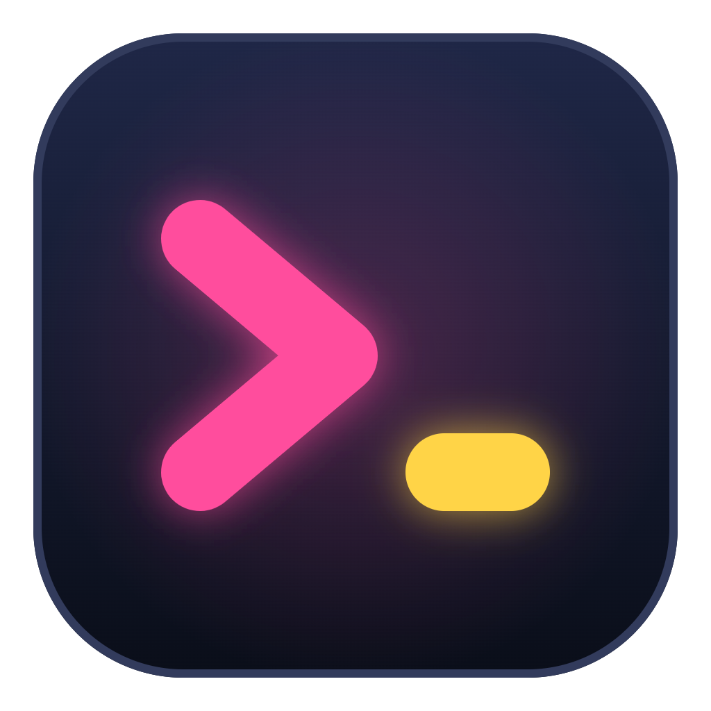
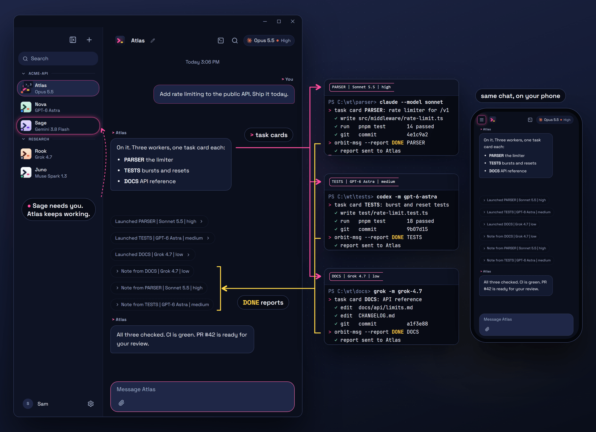
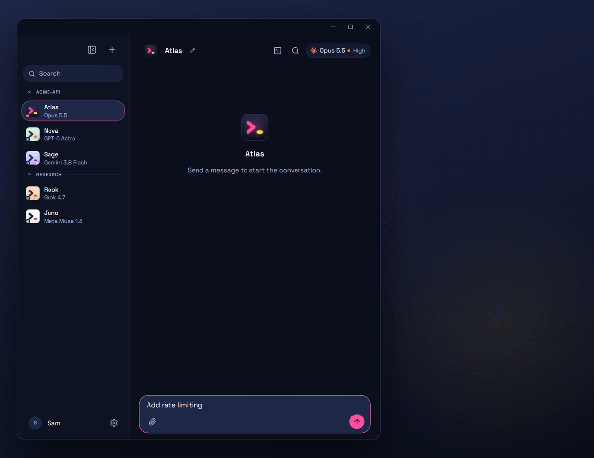
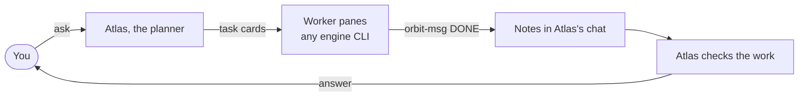

<h1 align="center">
  <br>
  Wink
</h1>

<p align="center">
  <a href="https://github.com/aiedwardyi/Orbit/actions/workflows/ci.yml"></a>
  <a href="https://github.com/aiedwardyi/orbit-releases/releases/latest"></a>
  <a href="LICENSE"></a>
</p>

<p align="center">
  Desktop app for AI teammates that remember their projects, plan with you, and hand work to terminal workers.
  <br>
  No API keys. Runs on the Claude Code, Codex, Gemini, Grok and Muse logins you already pay for. No telemetry.
</p>

<p align="center">
  
  <br>
  <sub>Atlas hands out task cards, three terminal workers report back, and Sage's question glows without stopping the work.</sub>
</p>

## Quickstart

1. Install at least one [engine CLI](#engines) and sign in once.
2. Download **[Wink-setup.exe](https://github.com/aiedwardyi/orbit-releases/releases/latest/download/Wink-setup.exe)** and run it (Windows 10 / 11, x64).
3. Wink finds the engines on this PC. Create a bot, give it a job, and message it like anyone else.

The installer isn't code-signed yet, so SmartScreen may say "Windows protected your PC". Choose **More info**, then **Run anyway**.

### What you get

- **Teammates, not tabs** - each bot keeps its name, role, model, memory file and task record across restarts, compaction and model switches.
- **Terminal workers** - a bot opens labeled panes (`PARSER | Sonnet 5.5 | high`), hands each worker a task card, and gets the DONE report back in its chat.
- **Questions that don't stop work** - a bot that needs you keeps going. Its row glows and the question stays pinned above the composer.
- **Switch models mid-thread** - move a conversation to another engine and keep the branch and task record.
- **Sync across PCs** - bots, memory and 1:1 chats through a folder you choose, such as Google Drive. Off until you turn it on.
- **Phone access** - a link over your Tailscale tailnet, or QR pairing through a [relay you host](relay/README.md).
- **Model index** - benchmark scores and API prices for current models, bundled and dated (`Alt+I`).
- **51 themes**, English and Korean.

<p align="center">
  
  <br>
  <sub>Panes open one by one, DONE notes land in the chat, and Atlas answers. Sage waits for you without holding anyone up.</sub>
</p>

## How it works

1. You ask a bot. Atlas, the planner here, splits the job and writes one task card per worker.
2. It opens a labeled terminal pane per worker, on any engine CLI you have. The built-in playbook tells it to give each worker its own git worktree.
3. Each card ends with `orbit-msg --report DONE <NICK>`. The report lands in Atlas's chat as a note with branch, sha and dirty state, and wakes Atlas.
4. Atlas checks the work and answers you. If it needs a decision, it asks without stopping.
5. Context carries over: each bot's `MEMORY.md` (up to 200 lines) goes into every prompt, a task record survives compaction and model switches, and the transcript is never pruned.



Long threads compact: past half the context window or 60 turns, Wink writes a summary and continues in a fresh session with the summary and the recent turns. The full transcript stays on disk.

## Engines

| Engine | CLI | Sign in |
|---|---|---|
| Claude Code | `claude` | `claude` |
| Codex | `codex` | `codex login` |
| Gemini (Antigravity) | `agy` | `agy` |
| Grok | `grok` | `grok login` |
| Muse | `muse` | `muse login` |

Install on Windows (PowerShell):

```powershell
irm https://claude.ai/install.ps1 | iex                  # Claude Code
npm install -g @openai/codex                             # Codex (needs Node.js)
irm https://antigravity.google/cli/install.ps1 | iex     # Gemini (Antigravity)
irm https://x.ai/cli/install.ps1 | iex                   # Grok
powershell -NoProfile -ExecutionPolicy Bypass -Command "irm https://api.meta.ai/muse-launcher.ps1 | iex"   # Muse
```

Engine logins stay in each CLI's own store. Wink drives the CLI with the session you already have. Add engines later in **Settings > Connections**. Muse runs natively and falls back to WSL.

## Trust and security

Wink has no analytics, telemetry or crash upload. This is everything it listens on, sends and stores.

**Listens** (this PC only)

- `127.0.0.1:8799` for the app (falls back to 18799, then 28799), behind a per-launch token and a Host/Origin check. The token lives in memory, and in a Claude turn's temp config until that turn ends.
- `127.0.0.1:8800` for webhooks, which rejects any request without a webhook's secret.
- Random token-protected `127.0.0.1` ports for the terminal and browser bridges.

**Sends with no setup**

- Update checks to GitHub Releases (`aiedwardyi/orbit-releases`) 15 s after launch, then hourly. The stock updater adds a random per-install ID header (`x-user-staging-id`) for staged rollouts. Downloads start only when you press the button and are checked against the release's sha512 hash. The build isn't code-signed yet.
- Your engine CLIs, which Wink starts to list models and check sign-in at launch, on refocus and in the model picker. Each talks to its own vendor with your login and keeps its own telemetry settings.
- `tailscale serve --bg --https=443` at launch when Tailscale is installed and logged in, so your phone can reach Wink over your tailnet. Tailnet only, never Funnel, and the API still needs the phone link's sign-in key. The rule stays after Wink quits. `ORBIT_REMOTE_AUTO=0` turns it off.
- Electron's built-in spellchecker, which can fetch a dictionary for your language from Google's Chromium CDN.

**Sends once you set something up**

- Phone relay, after you paste a setup code: a connection to your relay at every launch. TLS runs end to end between phone and PC, so the relay passes bytes it can't read. Wink also gets this PC's certificate from Let's Encrypt and checks crt.sh daily for certificates issued for its relay name.
- Phone notifications, once you allow them on the phone, go out encrypted through the phone browser's push service.
- Sync writes only to the folder you choose.
- Services you add a key for (Composio, ElevenLabs, AssemblyAI, OpenRouter or another OpenAI-compatible API, the xAI or MiniMax APIs, Box (ascii.dev), OpenAI images, and custom providers in your Codex config) are called with that key when you or a bot use them. Composio is also called at every launch once its key is set.

**Sends only when you act**

- **Settings > Usage > Refresh** calls Anthropic's usage API with your Claude Code login. If that login expired, Wink renews it with Anthropic and rewrites `~/.claude/.credentials.json`.
- Team Library, skill import and install links fetch from GitHub. Project scout queries `api.botdirectory.ai`. The Connected Apps panel loads app icons from Google's favicon service.
- Local VM and VPS setup pull images from Docker Hub and packages from PyPI, and reach your VPS over ssh.
- Images in a bot's reply load from wherever they point (there is no CSP), so a reply can make Wink fetch any URL.

**Stores**

- `~/.orbit` (or `OMB_DATA_DIR`): bots, chats (`messages.db`), each bot's `MEMORY.md`, task records, attachments, redacted engine event logs, phone pairing keys, a decision log, and checkpoints (a shadow git snapshot before each turn in a project folder). `orbit-msg` lives in `~/.orbit/bin`.
- `%APPDATA%\orbit-desktop`: Wink's own API keys in `credentials.bin`, encrypted with the Windows credential store through Electron `safeStorage`, the updater's install ID, and logs.
- Outside those, only while needed: `~/.gemini/config/mcp_config.json` during Antigravity turns (restored after), a temp `mcp.json` per Claude turn (deleted after), and `~/.grok/config.toml` for local Grok models.

**Approvals**

- New bots start in **Auto**: every tool request in a turn you start is approved, destructive ones included.
- **Ask** asks before any tool call you haven't always-allowed, and always before destructive or secret-reading ones. Codex always runs in its workspace-write sandbox. Antigravity can't ask in print mode, so Ask has no effect there.
- Engine CLIs start without a shell and without your `*_KEY`, `*_TOKEN` and `*_SECRET` variables, except what a driver needs.

**Workers**

- Workers run with their CLI's permission prompts off: `claude --dangerously-skip-permissions`, `codex --dangerously-bypass-approvals-and-sandbox`, `muse --yolo`, `grok --always-approve`.
- The built-in playbook tells bots to run each worker in its own git worktree, never your checkout. That is an instruction to the bot, not something Wink enforces.
- Pane shells don't inherit Wink's tokens or secrets. Panes close when Wink quits.

Report vulnerabilities through [SECURITY.md](SECURITY.md).

## Requirements

- Windows 10 or 11, x64
- At least one engine CLI with an active login
- Optional: [Tailscale](https://tailscale.com) on the PC and phone, for phone access (the free plan works)
- To build: Node.js 24+ and pnpm 10.33

## Compatibility

| Platform | Package | Status |
|---|---|---|
| Windows 10 / 11 (x64) | Installer with in-app updates | Supported |
| macOS | `pnpm package:mac`, local build | No release yet |
| Linux | Manual workflow (AppImage, deb) | No release yet |

`orbit-msg` reports are Windows only. Elsewhere the planner reads the worker's pane.

## Build from source

```powershell
git clone https://github.com/aiedwardyi/Orbit.git
cd Orbit
pnpm install --frozen-lockfile
pnpm dev:desktop    # the desktop app
pnpm dev            # or the browser UI at http://127.0.0.1:5199
pnpm package:win    # installer in release/
```

## Troubleshooting

**SmartScreen blocks the installer**
The installer isn't code-signed yet. Choose **More info**, then **Run anyway**.

**An engine shows as missing**
Install its CLI, run its sign-in command once in a terminal, then check **Settings > Connections**.

**Worker reports never arrive**
`orbit-msg` is installed on Windows only. Check that the card's last line runs `orbit-msg --report DONE|FAIL|BLOCKED <NICK>`. On macOS and Linux the planner reads the pane instead.

**No phone link in Settings**
The **Phone link** card shows once Tailscale is installed and logged in on this PC, and no other `tailscale serve` rule holds its port 443.

**Wink is on an old version**
Updates are checked hourly. Press the update button when it appears, or download the latest [Wink-setup.exe](https://github.com/aiedwardyi/orbit-releases/releases/latest/download/Wink-setup.exe).

## Contributing

Issues and pull requests are welcome. Start with [CONTRIBUTING.md](CONTRIBUTING.md).

If Wink is useful to you, a star helps others find it.

## Credits

Wink (formerly Orbit) is a derivative of [OpenMausBot](https://github.com/milind-soni/OpenMausBot) by Milind Soni, distributed under the Apache License 2.0. See [LICENSE](LICENSE) and [NOTICE](NOTICE).

The cross-model picker uses [Ghostex](https://github.com/maddada/Ghostex) (MIT) as its design source.

## License

Apache-2.0
